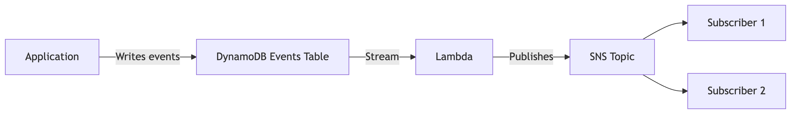

# Terraform AWS CMS Event Publisher Module

This Terraform module sets up an event publishing system for Content Management Systems (CMS) using AWS services. It creates DynamoDB tables for event storage, an SNS topic for event distribution, and a Lambda function to process and publish events.

## Features
🚀 **Event Sourcing Infrastructure**: Creates DynamoDB tables for events and snapshots  
🔔 **Real-time Event Publishing**: Uses DynamoDB Streams + Lambda to publish to SNS  
🔐 **Secure IAM Roles**: Auto-generated least-privilege permissions  
🌐 **Decoupled Architecture**: Enables event-driven microservices  

## Usage
```hcl
module "cms_event_publisher" {
  source          = "github.com/mergermarket/tf_cms_event_publisher?ref=v2.0.0"
  env             = "production"
  events_table    = "prod-cms-events"
  snapshots_table = "prod-cms-snapshots"
  cms_name        = "funds"  # Your CMS identifier
}
```

## Resources Created
| Resource Type | Purpose |
|--------------|---------|
| DynamoDB Table (Events) | Stores all CMS events with stream enabled (aggregateId + rowKey) |
| DynamoDB Table (Snapshots) | Periodic state snapshots (aggregateId + id) |
| SNS Topic | Distributes events to subscribers |
| Lambda Function | Processes DynamoDB streams and publishes to SNS (Node.js runtime) |
| IAM Roles/Policies | Secure access permissions for Lambda |

## Input Variables
| Variable | Type | Required | Default | Description |
|----------|------|----------|---------|-------------|
| env | string | Yes | - | Environment name (e.g., "prod", "staging") |
| events_table | string | Yes | - | Name for events DynamoDB table |
| snapshots_table | string | Yes | - | Name for snapshots DynamoDB table |
| cms_name | string | Yes | - | Unique CMS identifier (lowercase) |
| snapshots_read_capacity | number | No | 1 | Read capacity units for snapshots table |
| snapshots_write_capacity | number | No | 1 | Write capacity units for snapshots table |

## Outputs
| Output | Description |
|--------|-------------|
| events_table_arn | ARN of the DynamoDB events table |
| snapshots_table_arn | ARN of the DynamoDB snapshots table |
| events_topic_arn | ARN of the SNS event topic |
| created_events_table | Name of the created events table |
| created_snapshots_table | Name of the created snapshots table |

## Architecture


## Versioning
| Version | Terraform | Notes |
|---------|-----------|-------|
| v1.x.x | 0.11-0.12 | Legacy syntax (tags {}, interpolation) |
| v2.x.x | ≥0.13 | Modern syntax, recommended for new projects |

## Upgrade Guide
To upgrade from v1 to v2:

1. Update Terraform to ≥0.13
2. Change module source:

```diff
- source = "github.com/mergermarket/tf_cms_event_publisher?ref=v1.0.0"
+ source = "github.com/mergermarket/tf_cms_event_publisher?ref=v2.0.0"

